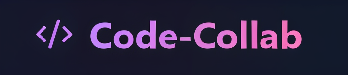

# 🧑‍💻Collaborative Code Editor

## Description

A collaborative, real-time code editor where users can seamlessly code together. It provides a platform for multiple users to enter a room, share a unique room ID, and collaborate on code simultaneously.

## ✨ Features
• ⚡ Real-time collaboration via WebSockets  
• 🎨 Syntax highlighting with Monaco Editor  
• 🌐 Language selection (JavaScript, Python, C++, Java, C#)  
• 🔗 Custom or Auto Generated room links to invite others  
• ⏱️ Instant updates and synchronization of code changes   
• 🚀 Code Execution: Users can execute the code directly within    the collaboration environment  
• 📣 Notifications for user join and leave events  

 
## 💻Tech Stack
- **Frontend**: React, Tailwind CSS, Zustand 
- **Backend**: Node.js, Express  
- **Real-time Communication**: Socket.IO  
- **Editor**: Monaco Editor (for syntax highlighting)  


## ⚙️Installation

Follow these steps to set up and run the Collaborative Code Editor on your local machine.


### 1. Clone the Repository

```bash
git clone https://github.com/Gaurav352/Code-Collab.git
cd Code-Collab
```
### 2. Install dependencies: Both directories

```bash
npm install
```
### 3. Start the servers 
Frontend
```bash
cd frontend
npm run dev
```
Backend
```bash
cd backend
npm run dev
```

### 4. Access the application:
```bash
http://localhost:5173/
```


   
